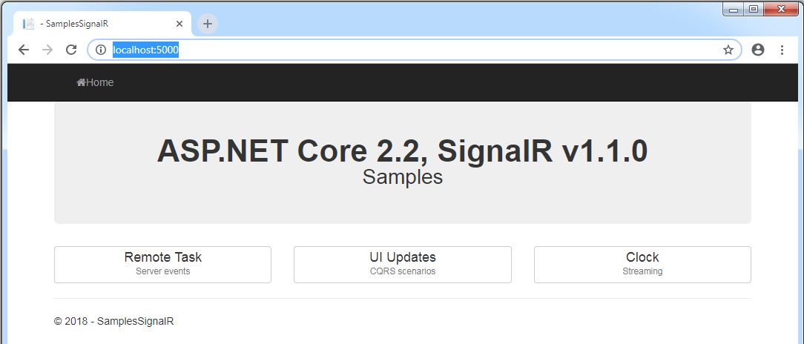
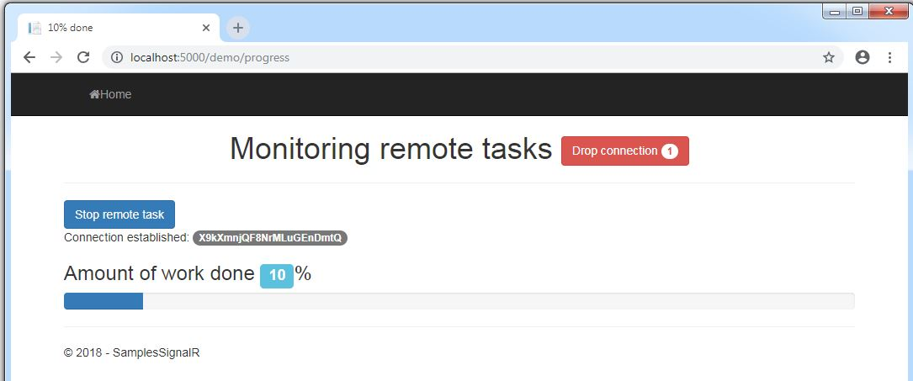
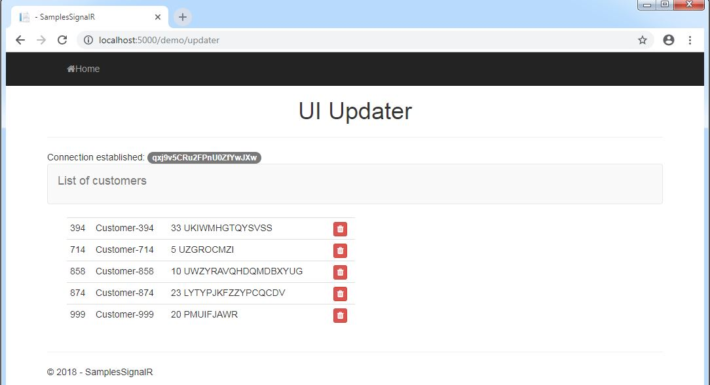
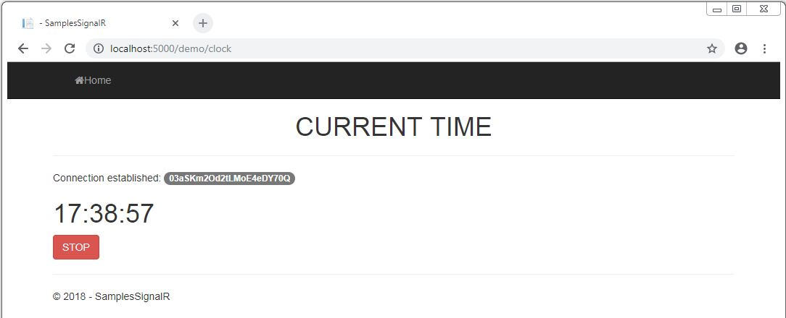

# Samples.MVC.SignalR
UI examples - ASP.NET Core 2.2, MVC, SignalR v1.1.0 

These UI examples demonstrate real-time notifications/updates/streaming

Inspired by code from "Programming ASP.NET Core" book: https://github.com/despos/ProgCore

See the sample project for details.

